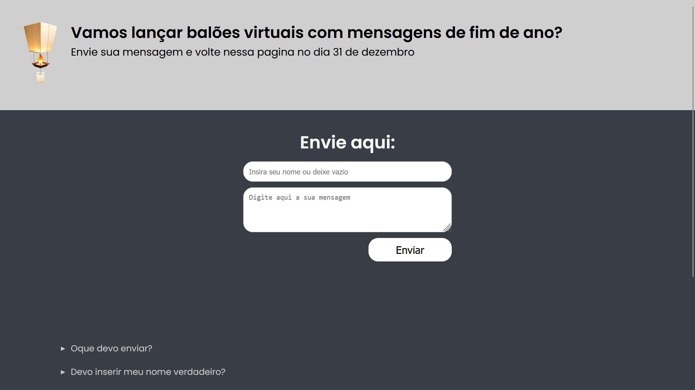
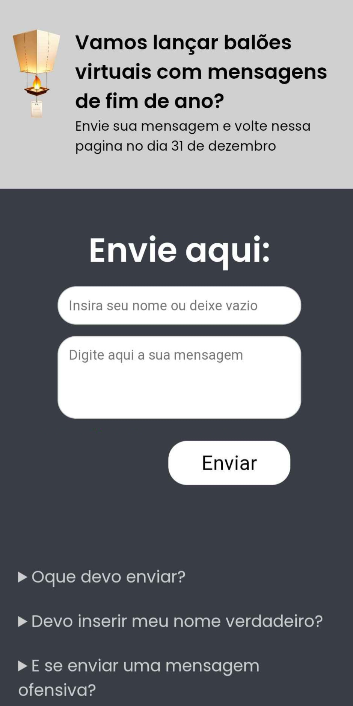

esse projeto simulou um ambiente em produção real, com frontend criado em nuxt, framework SSR baseado em Vue, o backend foi escrito em Node com typescript usando express e prisma.
durante o periodo de 26/12/2024 a 02/01/2025 o projeto esteve ativo com frontend pelo Vercel, e o backend e banco de dados pelo Render.
você pode conferir o codigo nuxt, e executar localmente adaptando partes do codigo.

- inicialize na pasta com 'npm i'
- para abrir a pagina digite 'npm run dev'
- confgure a api para simular em localhost ou defina string de um banco de dados criado um arquivo '.env' seguindo o padrão em 'store/api.js'
- crie um arquivo '.json' com a seguinte estrutura:
```bash
{
  "messages": [
    {
      "id": number,
      "name": "string",
      "message": "string",
    },
  ]
}
```
- digite '/result' na barra de endereços para ver o resultado.
